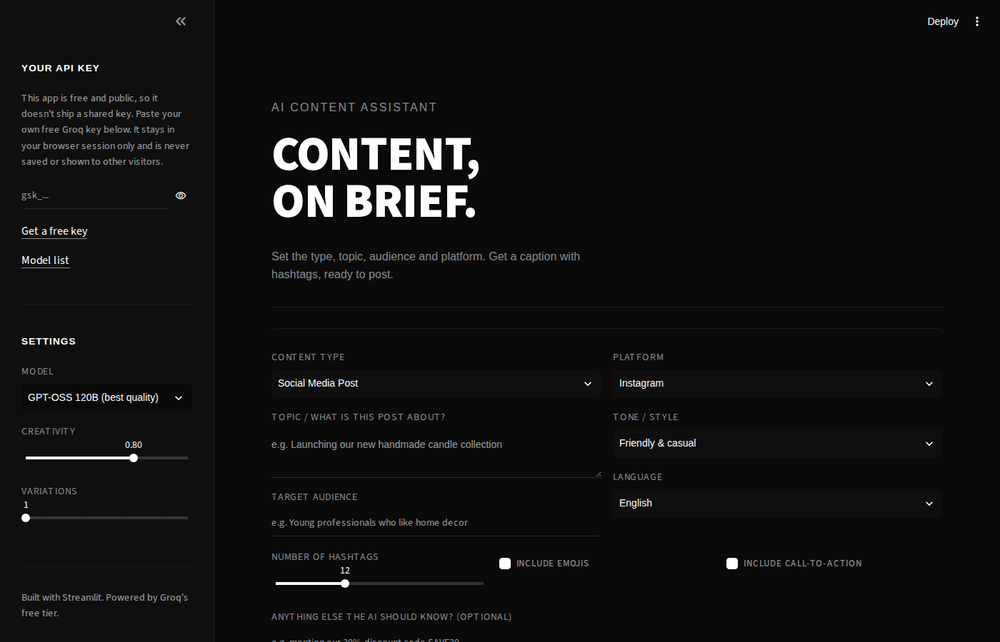

# AI Content Assistant

**Turn a short content brief into a ready to post social caption, with hashtags.**

AI Content Assistant is a Streamlit app that drafts social media copy from a
structured brief: content type, topic, audience, platform, tone, and
language. It calls a free Groq-hosted LLM to generate one or more caption
variations, each with matching hashtags, ready to copy or download.

**Live demo:** [your-app-name.streamlit.app](https://aicontentassistant-gkyeydzqmxjfzuzp5k4s6x.streamlit.app/) 

---

## Preview



---

## What it does

- **Structured brief**: content type, topic, target audience, platform, tone, language, hashtag count, and optional notes
- **Nine content types**: social posts, product launches, promotions, educational tips, stories, event announcements, blog intros, ad copy, video script hooks
- **Eight platform presets**: Instagram, X, LinkedIn, Facebook, TikTok, YouTube, Pinterest, Threads
- **Eight tone presets**: from friendly and casual to luxury and premium
- **Multi-language output**: English, Urdu, Roman Urdu, Spanish, French, Arabic, Hindi
- **Up to three variations per request**, each generated with matching hashtags
- **Bring-your-own-key (BYOK)**: every visitor uses their own free Groq API key, entered in the sidebar and held only for that browser session. Nothing is stored, logged, or shared between users.
- **Four selectable Groq models**, from fastest to highest quality
- **One-click copy and download**: grab a single version or export all variations as a `.txt` file

---

## How it works

The whole app lives in one file, `app.py`, with a simple linear flow:

1. **Collect the brief.** The sidebar takes the API key and model choice; the main form takes content type, topic, audience, platform, tone, language, hashtag count, and toggles for emojis and a call to action.
2. **Build one prompt.** `build_prompt()` assembles the brief into a single instruction that asks for strict JSON output: a list of `{caption, hashtags}` objects.
3. **Call Groq.** `call_groq()` sends that prompt to the selected model on GroqCloud's OpenAI-compatible chat completions endpoint, using `response_format: json_object` for reliable structured output.
4. **Render results.** Each version is parsed and displayed as a caption card with hashtag tags, a copy-ready text box, and a combined download button.

No content, prompts, or API keys are stored server-side. Everything lives in
the visitor's own browser session (`st.session_state`) for the duration of
their visit.

### Models

| Model | Notes |
|---|---|
| GPT-OSS 120B | Best quality, default |
| GPT-OSS 20B | Fastest |
| Qwen 3.6 27B | Balanced |
| Llama 4 Maverick 17B | Balanced |

Groq periodically deprecates older models (this already happened to
`llama-3.3-70b-versatile`, `llama-3.1-8b-instant`, and `gemma2-9b-it`). If a
model starts erroring with `model_decommissioned`, check the current list at
[console.groq.com/docs/deprecations](https://console.groq.com/docs/deprecations)
and update the `GROQ_MODELS` dict at the top of `app.py`.

---

## Getting started locally

```bash
git clone https://github.com/<your-username>/ai-content-assistant.git
cd ai-content-assistant
pip install -r requirements.txt
streamlit run app.py
```

Open the local URL Streamlit prints (usually `http://localhost:8501`), then
paste your own free Groq API key into the sidebar.

| Service | Where to get it |
|---|---|
| **Groq** | Sign in at [console.groq.com/keys](https://console.groq.com/keys) → **Create API Key** |

---

## Deployment

Deployed on [Streamlit Community Cloud](https://share.streamlit.io): free,
permanent HTTPS, auto-redeploys on every push to `main`. No secrets need to
be configured there, since the app never uses an owner-side API key; each
visitor supplies their own at runtime.

Repo layout it expects:

```
ai-content-assistant/
├── app.py
├── requirements.txt
└── .streamlit/
    └── config.toml
```

---

## Design

The UI is a monochrome, editorial look: true black background, one bold
grotesk typeface (Archivo), underline-only form fields, no color accent. All
styling lives in the `CUSTOM_CSS` block near the top of `app.py`.

---

## Built with

- [Streamlit](https://streamlit.io): UI framework
- [Groq API](https://console.groq.com/docs): free-tier LLM inference (OpenAI-compatible chat completions)
- Python 3, `requests`

---

## License

Add a license of your choice (for example MIT) via **Add file → Create new
file → LICENSE** on GitHub.
